# **Projeto Integrador (Senac) - Técnico em informática**
## **💻Site de locação de jogos + App desktop de gestão de banco de dados**

### **🛠️Status atual do projeto**:

- App de administração do banco de dados finalizado!
- Site de locação de jogos em desenvolvimento

___

### **📑Dependências**:
- Python 3.12.3
- Flask 3.1.0
- Flask-SQLAlchemy 3.1.1
- Flet 0.27.6
- PyMySQ 1.1.1
- MySQL 8.0.41

___

### **⚙️App de administração**

#### **Sobre**: 
O app de administração é um aplicativo desktop desenvolvido com o objetivo de ser utilizado como ferramenta na gestão e no suporte ao site de locação de jogos GameOver. Suas funcionalidades incluem a possibilidade de realizar operações de CRUD (Create, Read, Update e Delete) em um banco de dados MySQL, permitindo que os administradores do site gerenciem os dados de forma eficiente e prática. O app foi desenvolvido utilizando a linguagem Python, o microframework Flet para a interface gráfica, o MySQL para persistência dos dados e o ORM SQLAlchemy para mapear as tabelas do banco de dados e trabalhar com seus registros por meio de objetos, proporcionando uma experiência amigável e intuitiva aos usuários.

 

#### **Funcionalidades**: 
A seguir estão listadas as funcionalidades do aplicativo de administração e alguns prints de cada uma delas.

**TELA DE LOGIN**: As contas dos usuários administradores são armazenadas em um banco de dados, e o app realiza a autenticação através de um sistema de login.
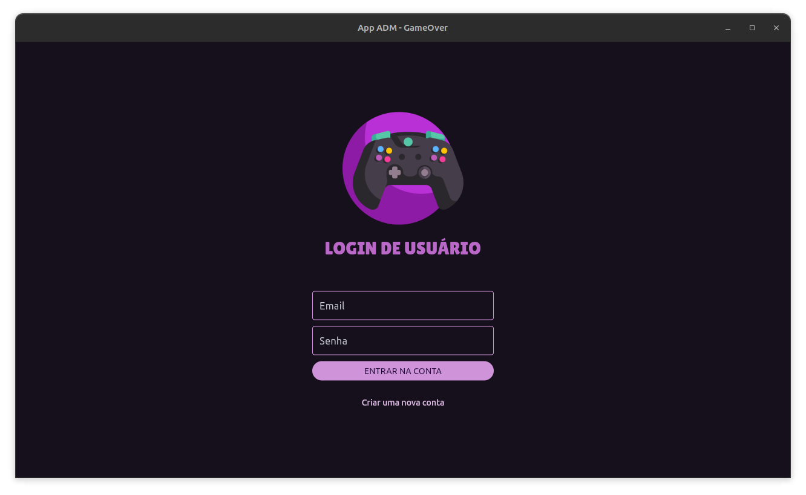

 

**TELA DE CADASTRO**: Novos administradores podem ser cadastrados no sistema.
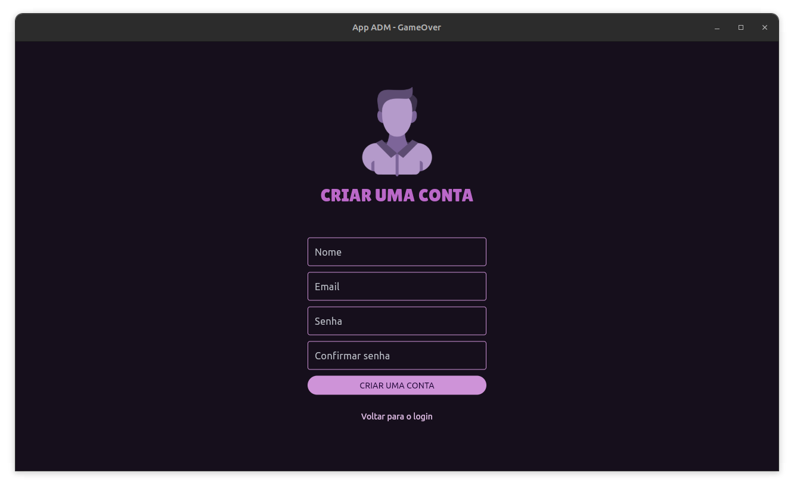

 

**TELA DE CONSULTA**: Permite visualizar todos os registros das tabelas do banco de dados, além de ter a possibilidade de filtrar os dados se necessário.
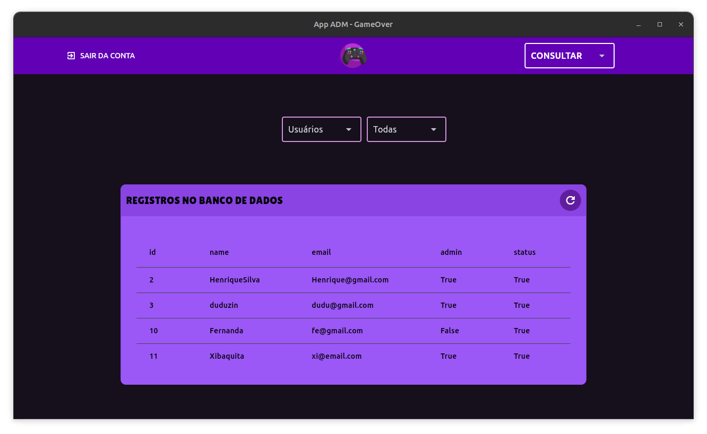

 

**TELA DE INSERÇÃO**: Permite inserir novos registros nas tabelas do banco de dados, como novos jogos, aluguéis e usuários.
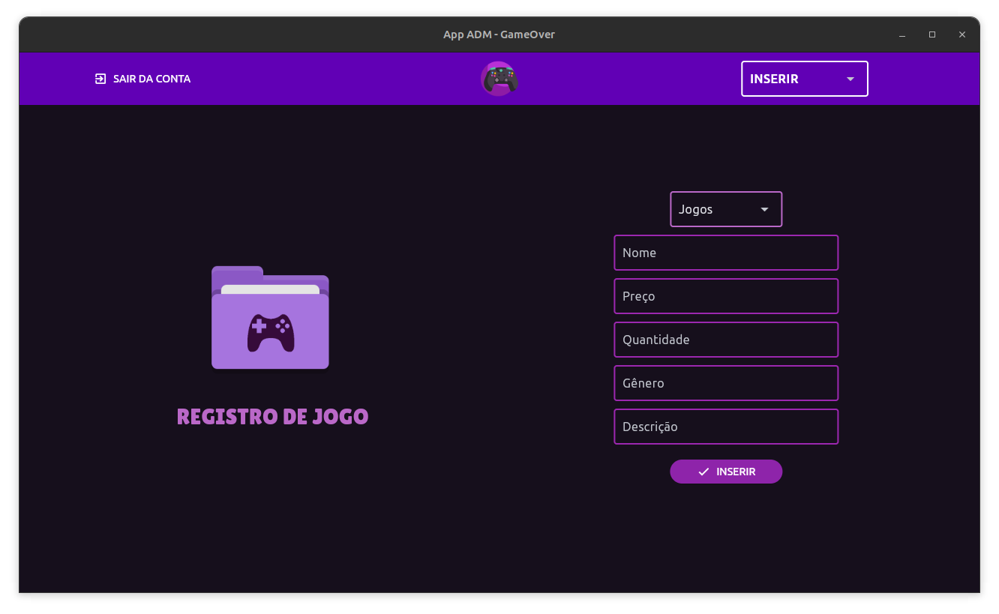

 

**TELA DE ATUALIZAÇÃO**: Permite atualizar os dados de registros já existentes no banco de dados em qualquer tabela.
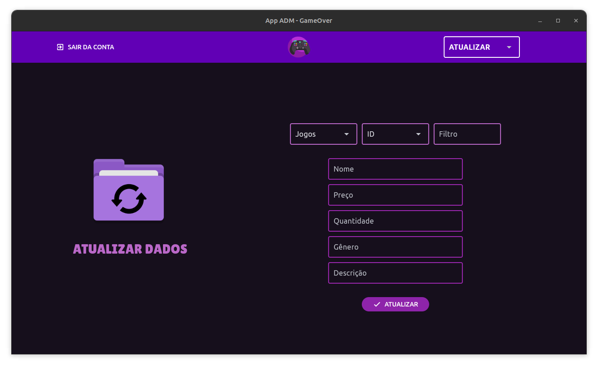

 

**TELA DE EXCLUSÃO**: Permite excluir um registro já existente no banco de dados em qualquer tabela.
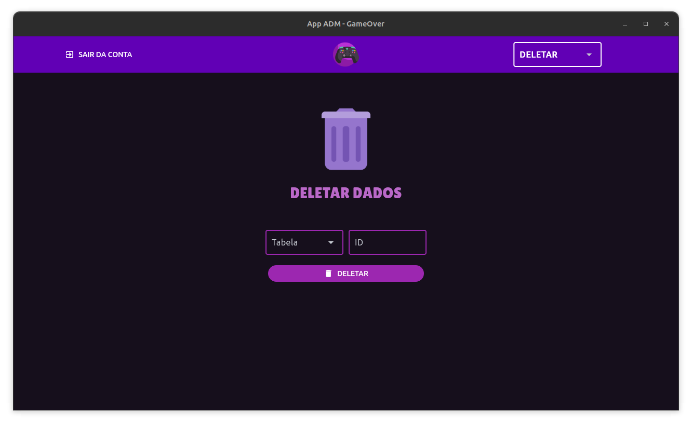

___

### **⚙️Site de locação de jogos**

#### **Sobre**: 
A aplicação WEB foi desenvolvida com o objetivo de ser utilizado como uma sollução para os altos preços dos jogos, por meio da locação de mídias digitais. Suas funcionalidades incluem a possibilidade de navegar pelo catálogo, ver fotos e trailers de jogos, pesquisar jogos específicos e viasualizar o histórico de jogos já alugados anteriormente. O app foi desenvolvido utilizando a linguagem Python, o micro microframework Flask para o gerenciamento de rotas, o MySQL para persistência dos dados e o ORM SQLAlchemy para mapear as tabelas do banco de dados e trabalhar com seus registros por meio de objetos, proporcionando uma experiência amigável e intuitiva aos usuários.

**TELA DE LOGIN**: Usuários podem se conectar as suas contas.
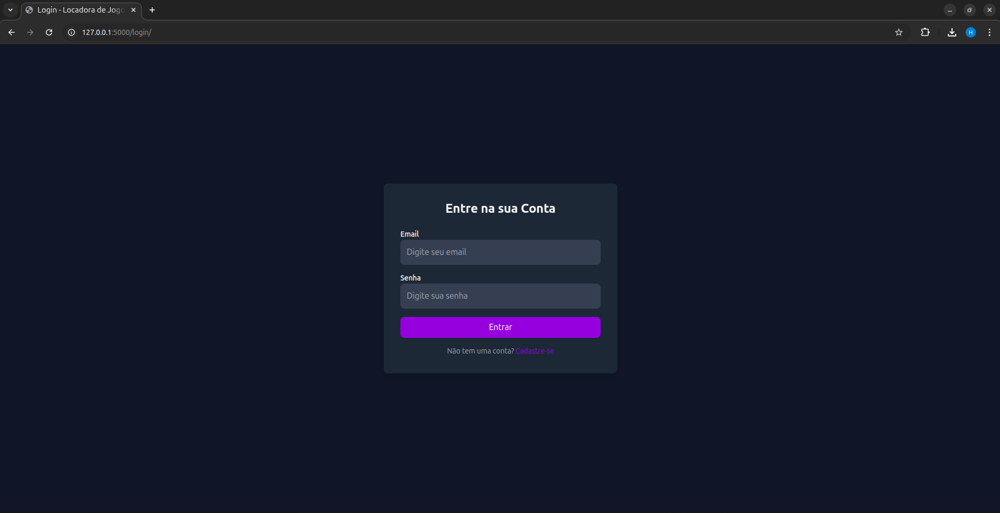

 

**TELA DE CADASTRO**: Novos usuários podem se cadastrar no site.
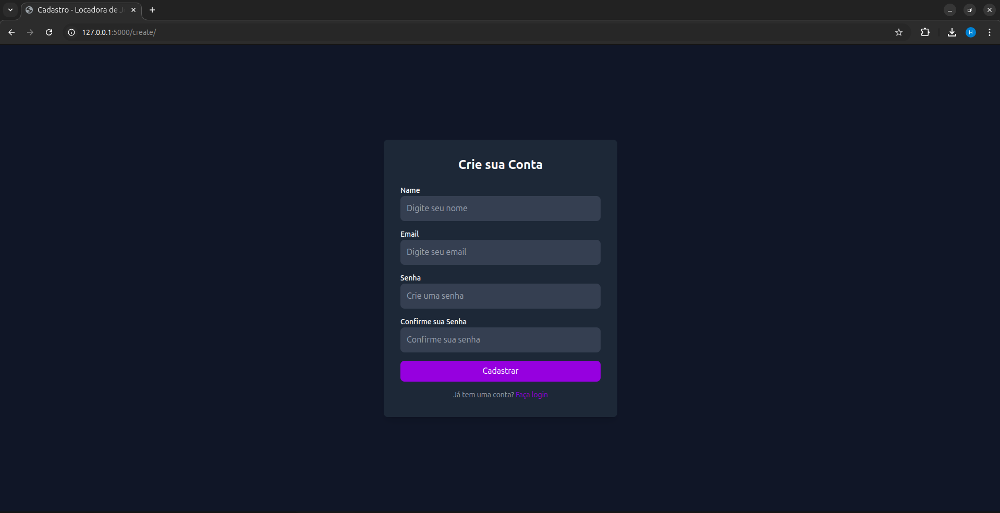

 

**HOME DO SITE**: Usuários tem a opção de escolher entre os jogos mais baratos e jogos de tiro.
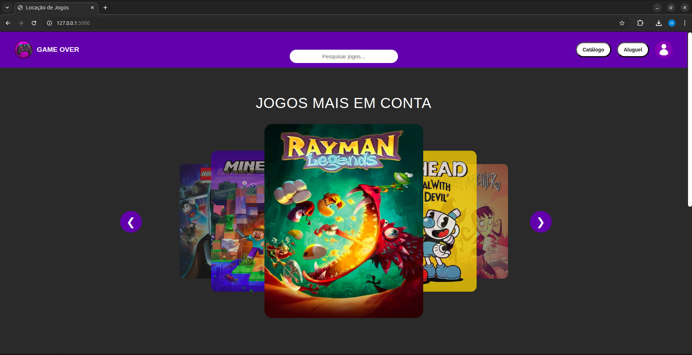
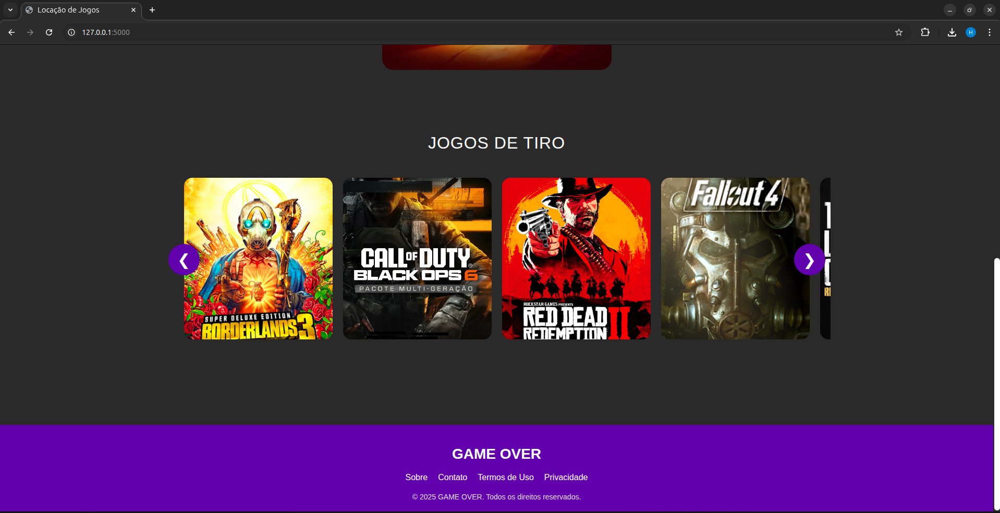

 

**CATÀLOGO DE JOGOS**: Página com todos os jogos disponíveis no site.
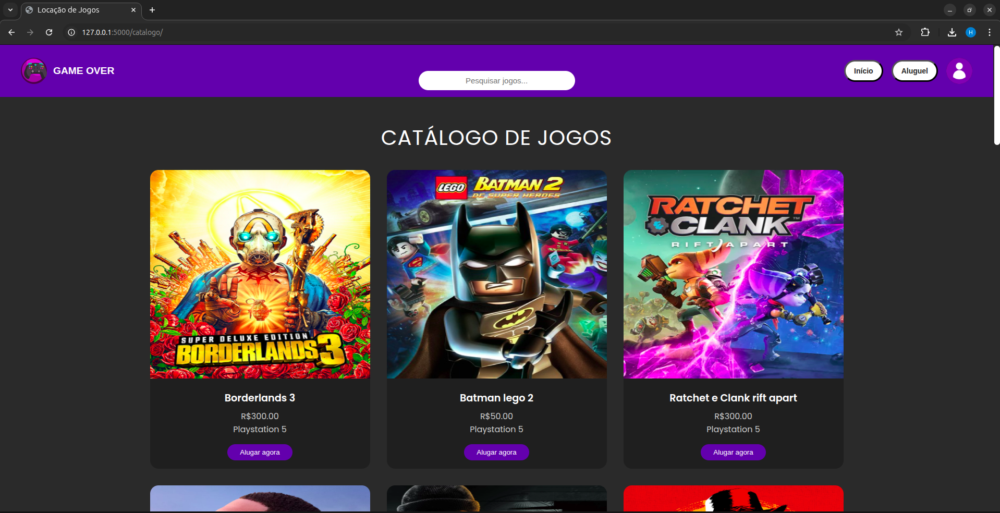

**PÁGINA DE PRODUTO**: Informações, imagens e trailer sobre o jogo selecionado.
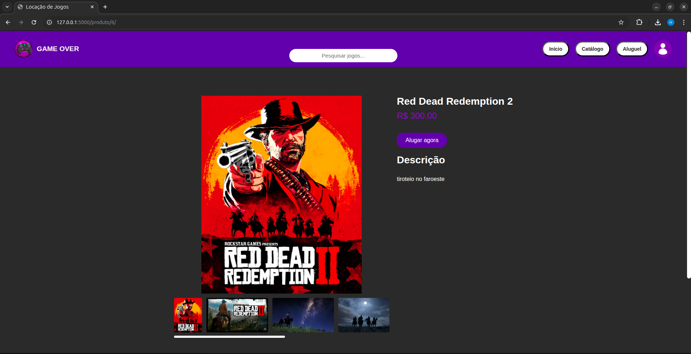

**HISTÒRICO DE LOCAÇÕES**: Histórico de locações de jogos do usuário.
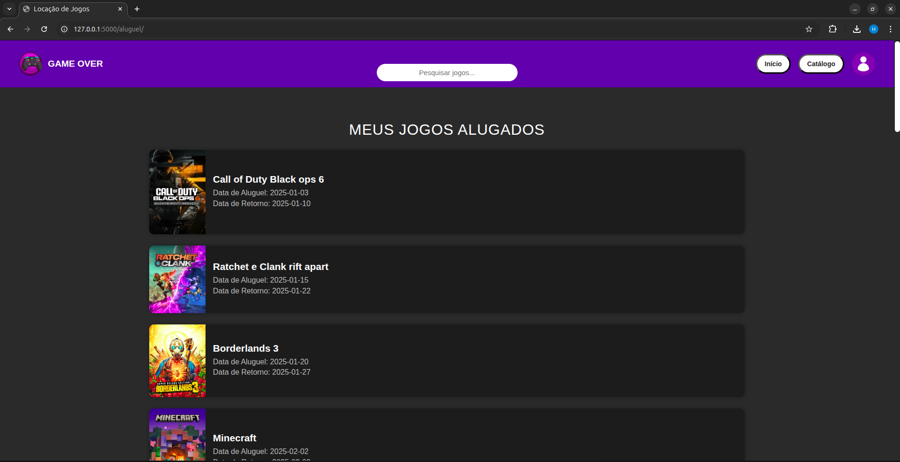

