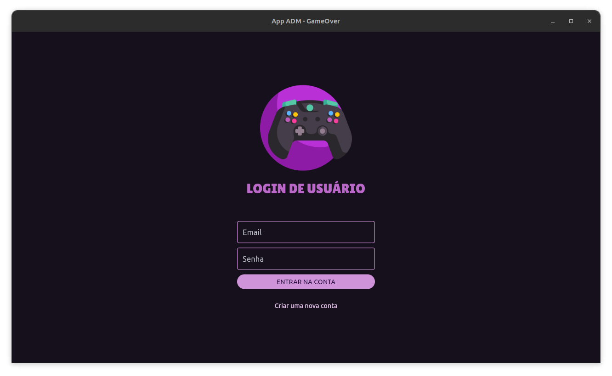
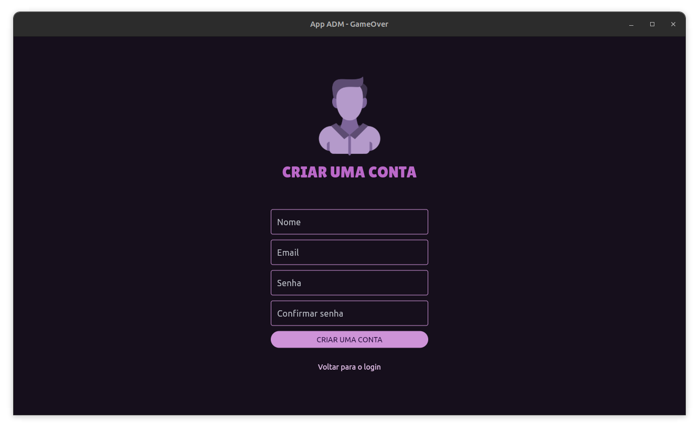
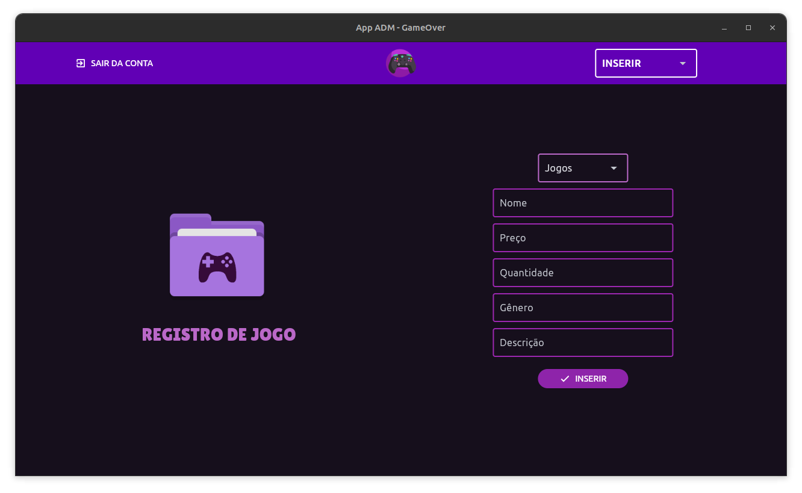
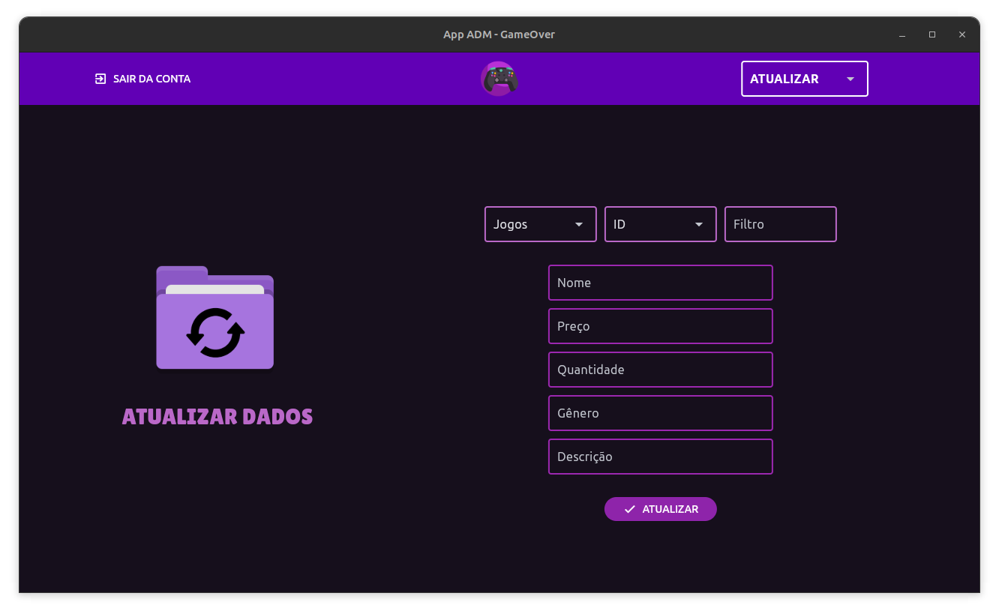
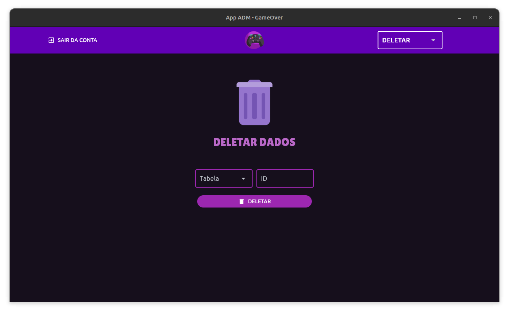

# **Projeto Integrador (Senac) - Técnico em informática**
## **💻Site de locação de jogos + App desktop de gestão de banco de dados**

### **🛠️Status atual do projeto**:

- App de administração do banco de dados finalizado!
- Site de locação de jogos em desenvolvimento

___

### **⚙️App de administração**

#### **Sobre**: 
O app de administração é um  aplicativo desktop que foi desenvolvido com o objetivo de ser utilizado como uma ferramenta na gestão e suporte ao site de locação de jogos, GameOver. Suas funcionalidades incluem a possibilidade de realizar operações de CRUD (Create, Read, Update e Delete) em um banco de dados MySQL, permitindo que os administradores do site possam gerenciar os dados de forma eficiente e prática. O app foi desenvolvido utilizando a linguagem Python e o micro-framework Flet para a interface gráfica, proporcionando uma experiência amigável e intuitiva para os usuários.

 

#### **Funcionalidades**:
A seguir estão listadas as funcionalidades do app de administração e algumas imagens ilustrativas de cada uma delas.

**TELA DE LOGIN**: As contas dos usuários administradores são armazenadas em um banco de dados, e o app realiza a autenticação através de um sistema de login.

 

**TELA DE CADASTRO**: Novos administradores podem ser cadastrados no sistema.

 

**TELA DE CONSULTA**: Permite visualizar todos os registros nas tabelas do banco de dados, além de poderem filtrar os dados se necessário.

 

**TELA DE INSERÇÃO**: Permite inserir novos registros nas tabelas do banco de dados, como novos jogos, aluguéis e usuários.

 

**TELA DE ATUALIZAÇÃO**: Permite atualizar os dados de um registro já existente no banco de dados em qualquer tabela.

 

**TELA DE EXCLUSÃO**: Permite excluir um registro já existente no banco de dados em qualquer tabela.

___

